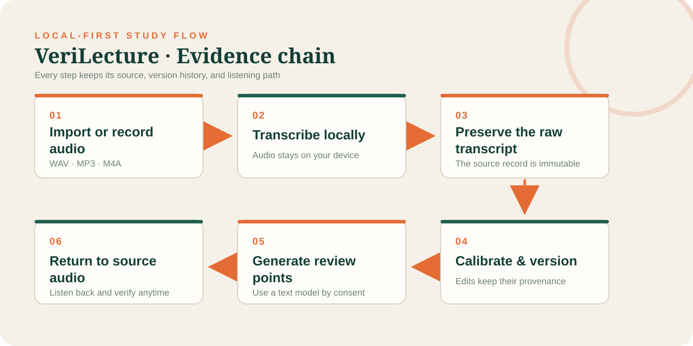
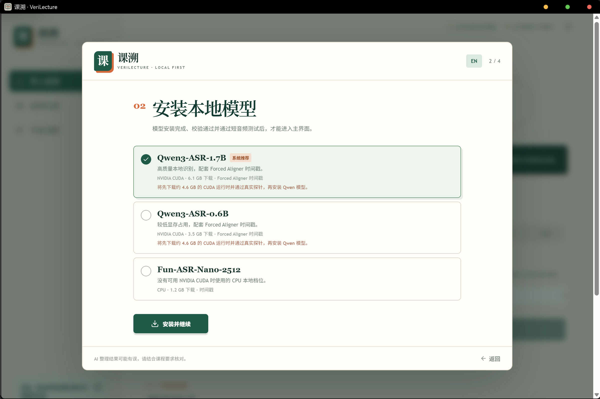
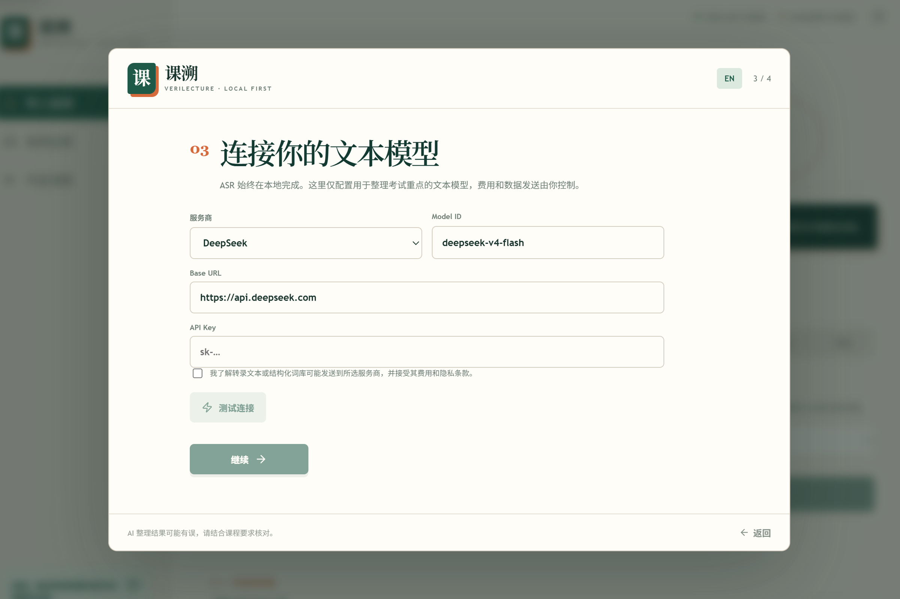
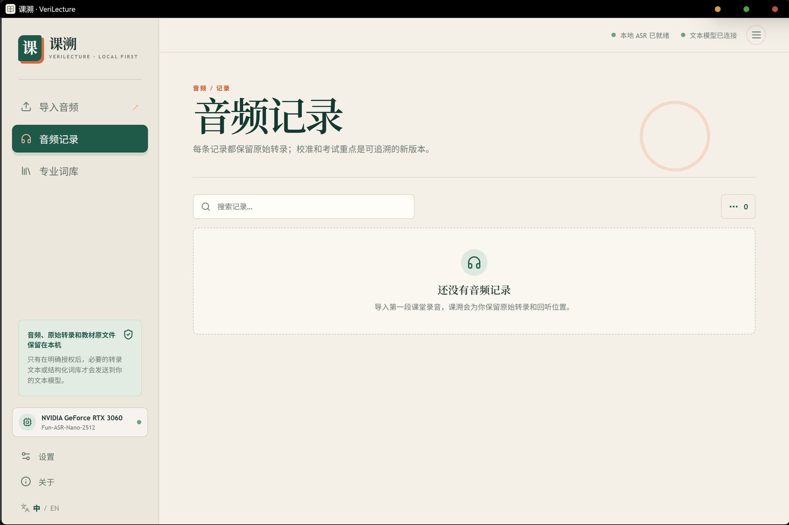
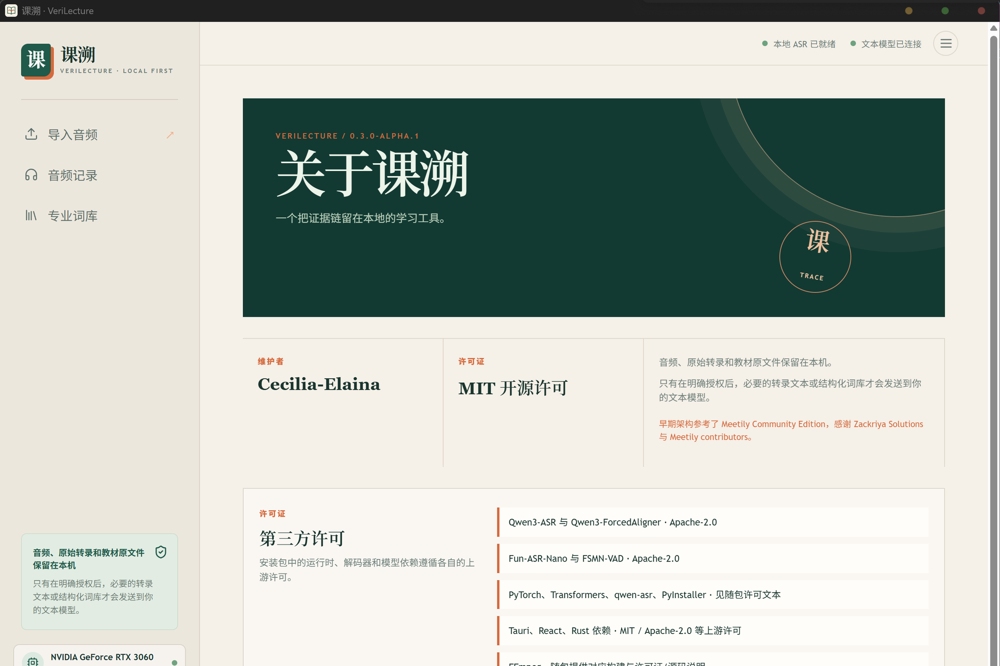

# VeriLecture

<div align="center">

**Turn lecture recordings into review points you can check.**

`Trace every key point back to the lecture.`

[](https://github.com/Cecilia-Elaina/verilecture-v3/releases/tag/v0.3.0-alpha.3)
[](https://github.com/Cecilia-Elaina/verilecture-v3/releases)
[](#privacy-by-design)
[](./LICENSE)

<p>
  <a href="./README.md">简体中文</a>
  &nbsp;·&nbsp;
  <strong>English</strong>
</p>

<p>
  <a href="https://cecilia-elaina.github.io/verilecture-v3/">Product website</a>
  &nbsp;·&nbsp;
  <a href="https://cecilia-elaina.github.io/verilecture-v3/">产品主页</a>
</p>

<a href="./docs/screenshots/audio-import-selected.png"></a>

<sub>Local-first by design · original audio, raw transcripts, and derived versions stay on your device</sub>

</div>

## What VeriLecture solves

After class, finding the key sentence can take longer than listening again. VeriLecture turns a lecture recording into review points and keeps each point linked to its source. When something needs checking, jump back to the relevant moment in the audio.

<p align="center">
  <a href="./docs/diagrams/evidence-chain-en.svg"></a>
</p>

## How it works

1. **Import a lecture recording**: WAV, MP3, M4A, MP4, FLAC, and OGG are supported.
2. **Keep the raw transcript**: use the local path first and save the original text separately.
3. **Calibrate with course material**: use a textbook and lexicon to check high-risk terms.
4. **Organize the key points**: keep explicit teacher statements separate from system inference.
5. **Return to the source**: jump from a point to its timestamp, then export the result if needed.

## Core capabilities

- **Local-first by default**: audio, raw transcripts, and course files stay on the device.
- **Route by hardware**: the first launch checks CPU, memory, GPU, CUDA, and storage, then recommends an available local transcription tier.
- **Several local transcription tiers**: Fun-ASR-Nano-2512 for CPU, and Qwen3-ASR-0.6B or Qwen3-ASR-1.7B for CUDA machines.
- **The source is never overwritten**: corrections, calibration, and user edits create new versioned records with provenance.
- **Statements stay separate from inference**: explicit exam points, exclusions, repeated emphasis, and system inference remain distinct.
- **Optional text model**: point generation is a separate step; necessary text is sent to the selected provider only after consent.

## Platform status

`v0.3.0-alpha.3` publishes Windows, Linux, and macOS desktop packages. The Linux and macOS packages provide the desktop application first; their native local transcription runtimes still need separate validation.

| Platform | Package | Current local transcription status |
| --- | --- | --- |
| Windows x64 | NSIS | Fun-ASR and CUDA Runtime paths available |
| Linux x64 | AppImage | Desktop package published; local transcription runtime pending |
| macOS | DMG | Desktop package published; local transcription runtime pending |

## Product preview

<table>
<tr>
<td width="50%" valign="top">
<a href="./docs/screenshots/onboarding-model-selection.png"></a>
<br /><sub><b>01 · Choose a local transcription tier</b><br />Select an available local route for the hardware.</sub>
</td>
<td width="50%" valign="top">
<a href="./docs/screenshots/onboarding-text-model.png"></a>
<br /><sub><b>02 · Connect a text model</b><br />Configure text organization only when you need it.</sub>
</td>
</tr>
<tr>
<td valign="top">
<a href="./docs/screenshots/onboarding-import-audio.png"></a>
<br /><sub><b>03 · Import lecture audio</b><br />WAV, MP3, and M4A are supported directly.</sub>
</td>
<td valign="top">
<a href="./docs/screenshots/audio-records-empty.png"></a>
<br /><sub><b>04 · View audio records</b><br />Open a record to read the transcript or listen back.</sub>
</td>
</tr>
<tr>
<td valign="top">
<a href="./docs/screenshots/settings-models-and-text.png"></a>
<br /><sub><b>05 · Check runtime status</b><br />Hardware, local transcription, and text-model status stay together.</sub>
</td>
<td valign="top">
<a href="./docs/screenshots/lexicon-empty-state.png"></a>
<br /><sub><b>06 · Maintain course terms</b><br />Use course vocabulary to calibrate specialized terms.</sub>
</td>
</tr>
<tr>
<td valign="top">
<a href="./docs/screenshots/about-and-licenses.png"></a>
<br /><sub><b>07 · Read the licenses</b><br />Third-party components and licenses are listed in the app.</sub>
</td>
<td valign="top">
<a href="./docs/screenshots/audio-import-selected.png"></a>
<br /><sub><b>08 · Return to the source</b><br />Every derived version stays associated with its recording.</sub>
</td>
</tr>
</table>

## Local transcription tiers

| Tier | Best for | Acceleration | `v0.3.0-alpha.3` status |
| --- | --- | --- | --- |
| **Fun-ASR-Nano-2512** | Machines without a usable NVIDIA CUDA path | CPU | Representative CPU installation and runtime path verified |
| **Qwen3-ASR-0.6B** | Lower-VRAM CUDA machines | NVIDIA CUDA | Registry and installer path prepared; independent GPU retest deferred |
| **Qwen3-ASR-1.7B** | Higher-quality local transcription | NVIDIA CUDA | Representative RTX 3060 GPU smoke test passed |

The Qwen tiers share a CUDA Runtime and ForcedAligner. The approximately 4.6 GB (about 4.3 GiB) Runtime is intentionally excluded from this Release and from Git. Until it is hosted at a stable HTTPS address and marked `published`, the installer keeps the download gated. See [CUDA Runtime publishing](./docs/CUDA_RUNTIME.md) for the release procedure.

## Privacy by design

- **Audio, source files, and raw transcripts stay on the device by default.**
- Local transcription does not upload audio.
- Text-model requests require explicit consent and a user-configured provider.
- Source excerpts and structured lexicon data are sent only when the matching permission is enabled.
- Raw material is immutable; edits create new versions with provenance.

See [Privacy and Security](./docs/PRIVACY_AND_SECURITY.md), [Model Sources](./docs/MODEL_REGISTRY.md), and [Third-party notices](./THIRD_PARTY_NOTICES.md).

## Download and run

Download the Windows x64 NSIS installer, Linux x64 AppImage, or macOS DMG from the [V3 pre-release](https://github.com/Cecilia-Elaina/verilecture-v3/releases/tag/v0.3.0-alpha.3). This is an Alpha build; back up important recordings before installing.

On first launch:

1. Read the privacy boundary and choose the consent scope.
2. Let VeriLecture scan hardware, CUDA, storage, and the model directory.
3. Install the recommended local transcription tier.
4. Run a short audio test before importing a full lecture.

Choose **Fun-ASR-Nano-2512** when no usable NVIDIA GPU is available. For Qwen, wait for a Release whose notes explicitly state that the CUDA Runtime is publicly hosted.

## Build from source

The supported application source lives under `frontend/`; generated build output stays outside Git. Read [writing/STYLE_GUIDE.md](./writing/STYLE_GUIDE.md) before changing user-facing text.

```powershell
Set-Location .\frontend
pnpm install --frozen-lockfile
pnpm typecheck
pnpm test
pnpm build
pnpm exec tauri build --ci --bundles nsis      # Windows
# pnpm exec tauri build --ci --config src-tauri/tauri.linux.conf.json --bundles appimage # Linux
# pnpm exec tauri build --ci --config src-tauri/tauri.macos.conf.json --bundles dmg      # macOS
```

Linux builds need Tauri's WebKitGTK development dependencies, and macOS builds need Xcode Command Line Tools; see the [Tauri prerequisites](https://tauri.app/start/prerequisites/) and [platform build notes](./docs/PLATFORM_BUILD.md). Windows fetches and verifies FFmpeg at build time; Linux/macOS currently use a system `ffmpeg` and do not commit a large third-party binary.

## Status and license

`v0.3.0-alpha.3` is the second public V3 milestone, not a final stable release. Windows, Linux, and macOS desktop packages are produced by the release workflow. The local workflow, onboarding, hardware routing, CPU path, and representative CUDA path are complete on Windows x64; native local transcription runtimes for Linux/macOS, public CUDA Runtime hosting, and clean-machine installation still need separate acceptance.

Read [Known Limitations](./docs/KNOWN_LIMITATIONS.md).

VeriLecture is released under the [MIT License](./LICENSE). Meetily upstream attribution and third-party licenses remain visible in [NOTICE](./NOTICE) and [THIRD_PARTY_NOTICES.md](./THIRD_PARTY_NOTICES.md).

**Developed by Cecilia-Elaina**

<div align="center">

<p>
  <a href="./README.md">简体中文</a>
  &nbsp;·&nbsp;
  <strong>English</strong>
</p>

</div>
