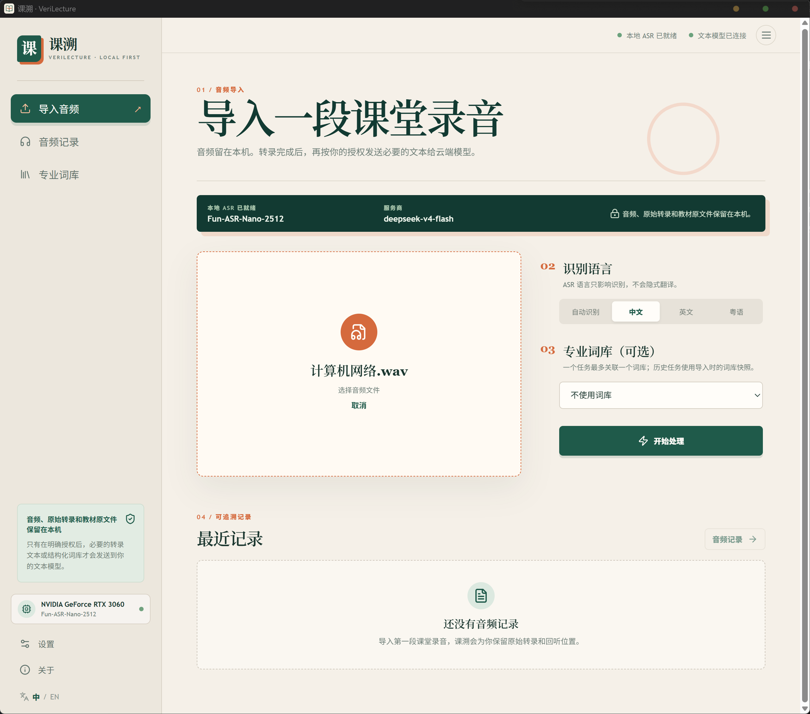
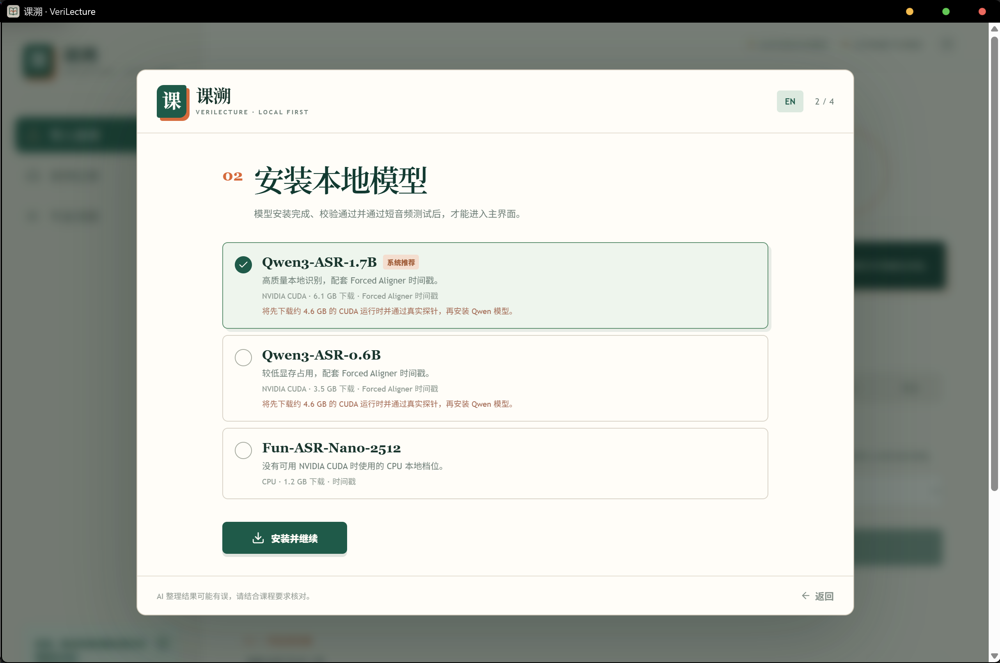
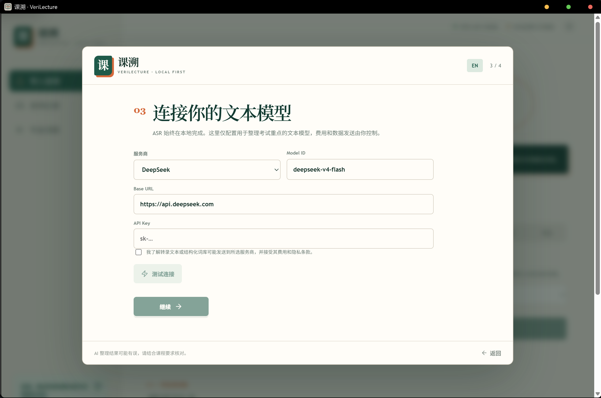
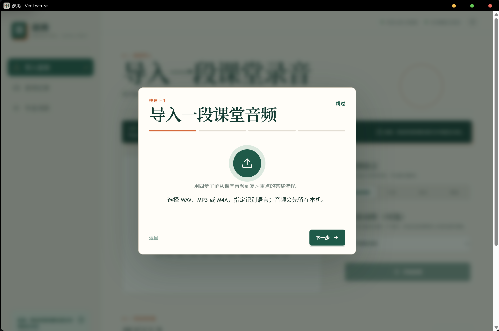
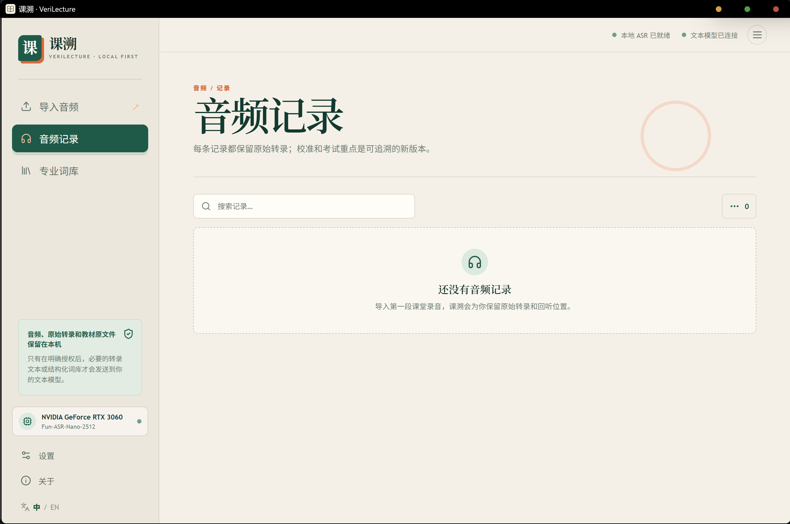
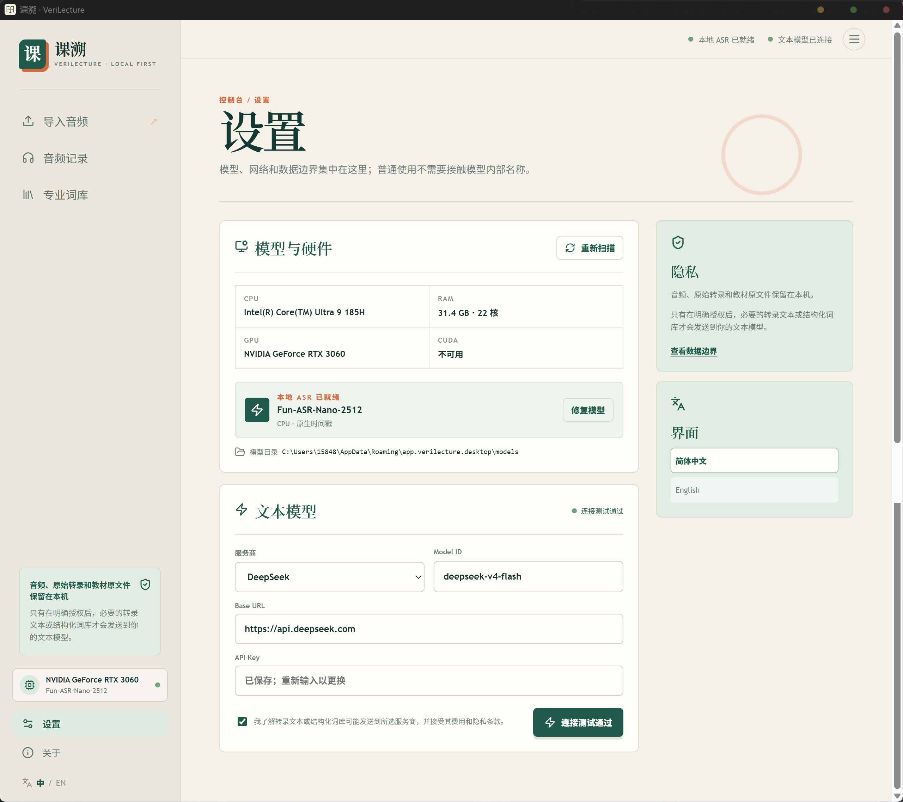
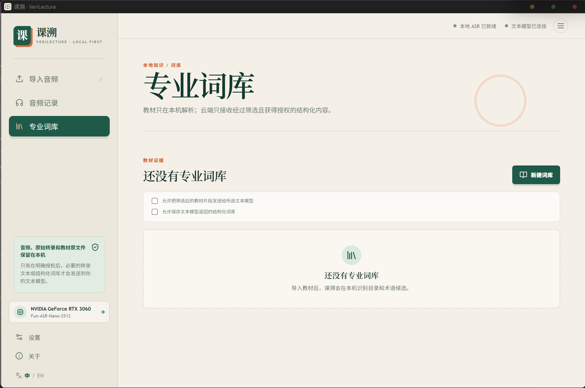
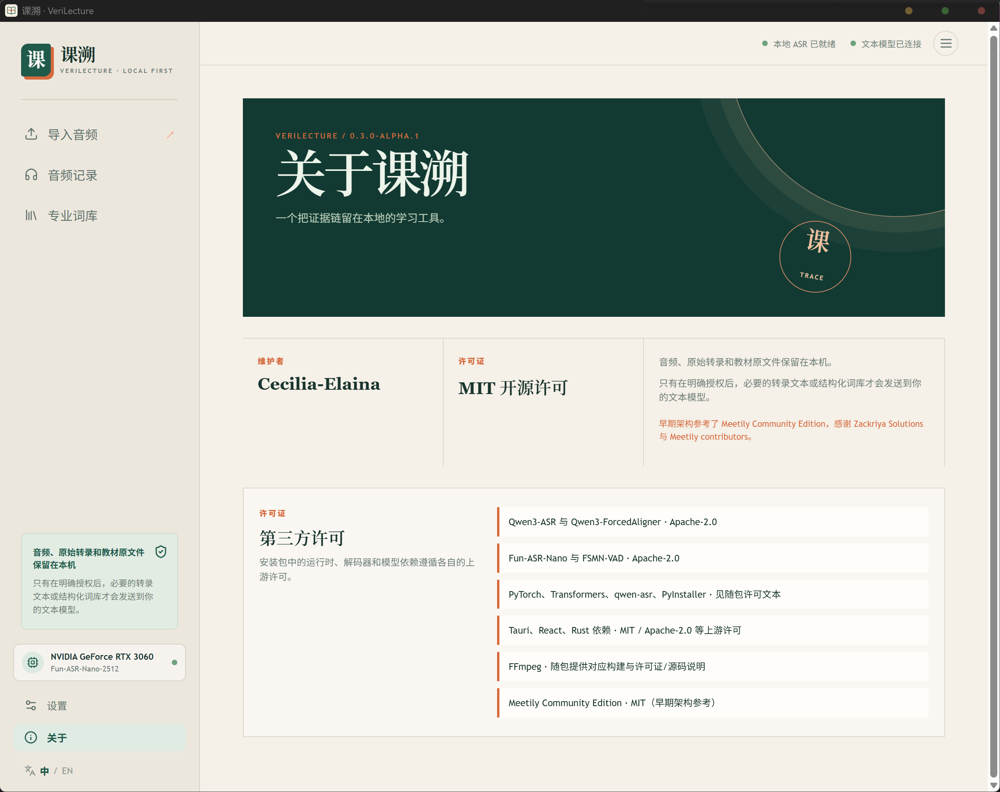

# 课溯 · VeriLecture

**A local-first lecture evidence chain for Windows.** 
**把每一段课堂录音，变成可回听、可校准、可追溯的学习材料。**

  <a href="#简体中文">🇨🇳 简体中文</a>
  &nbsp;·&nbsp;
  <a href="#english">🇬🇧 English</a>

Local-first by design · 原始音频、原始转写和证据链留在本机

## 简体中文

展开中文介绍

### 为什么是课溯

课堂笔记不应该只剩下一段无法核对的摘要。课溯把学习流程整理成一条可回溯的证据链：

**导入或录制音频 → 本地语音识别 → 保留原始转写 → 校准与版本化 → 生成重点 → 随时回到原音频核对。**

它面向学生、教师和研究者：获得 AI 辅助的效率，同时保留对原始材料、隐私和学习判断的控制权。

### 核心能力

- **本地优先**：音频、原始转写和课程文件默认保留在本机。
- **硬件感知引导**：首次启动会扫描 CPU、内存、GPU、CUDA 和存储，并推荐合适的本地 ASR 档位。
- **三档本地 ASR**：Fun-ASR-Nano-2512（CPU 回退）、Qwen3-ASR-0.6B（轻量 CUDA）和 Qwen3-ASR-1.7B（高质量 CUDA）。
- **证据不丢失**：原始音频与原始转写不会被覆盖；修订、校准和用户编辑都会产生带来源的新版本。
- **教师语义安全**：明确陈述、重复强调、推断主题和教材主题保持区分。
- **文本模型可选**：重点整理是独立且由用户控制的步骤，不影响本地转写。
- **中英文界面**：简体中文默认，英文界面同步维护。

### 产品预览

<table>
<tr>
<td width="50%">

 <b>01 · 选择本地 ASR 档位</b> 根据硬件选择易理解、可验证的模型层级。
</td>
<td width="50%">

 <b>02 · 连接文本模型</b> 只有在你选择时，才配置文本整理服务。
</td>
</tr>
<tr>
<td>

 <b>03 · 导入课堂音频</b> WAV、MP3 和 M4A 都是直接入口。
</td>
<td>

 <b>04 · 回到专注的记录空间</b> 清晰的空状态让下一步一目了然。
</td>
</tr>
<tr>
<td>

 <b>05 · 看见运行边界</b> 硬件、本地 ASR 与文本模型状态集中展示。
</td>
<td>

 <b>06 · 添加课程词汇</b> 本地词库帮助识别专业术语。
</td>
</tr>
<tr>
<td>

 <b>07 · 透明的基础</b> 第三方组件与许可始终可见。
</td>
<td>

 <b>08 · 随时回到证据</b> 原始录音与每个派生版本保持关联。
</td>
</tr>
</table>

### 本地 ASR 档位

| 档位 | 适用场景 | 加速方式 | <code>v0.3.0-alpha.1</code> 状态 |
| --- | --- | --- | --- |
| **Fun-ASR-Nano-2512** | 没有可用 NVIDIA CUDA 的机器 | CPU | CPU 安装和运行路径已完成代表性验证 |
| **Qwen3-ASR-0.6B** | 显存较小的 CUDA 机器 | NVIDIA CUDA | 注册表和安装路径已准备，独立 GPU 复测暂缓 |
| **Qwen3-ASR-1.7B** | 更高质量的本地转写 | NVIDIA CUDA | 已完成代表性 RTX 3060 GPU 冒烟测试 |

Qwen 档位共用 CUDA Runtime 与 ForcedAligner。约 4.6 GiB 的 Runtime 不包含在本次 Release 中，也不会提交进 Git；在它被放置到稳定 HTTPS 地址并标记为 <code>published</code> 前，安装器会保持下载门禁，避免展示失效下载。

### 隐私设计

- **音频、源文件和原始转写保留在本机。**
- 本地 ASR 不上传音频。
- 文本模型请求需要明确授权和用户配置的服务商。
- 只有在对应权限开启后，源文本片段或结构化词库内容才会发送。
- 原始材料不可变；编辑会创建带来源的新版本。

详见 [隐私与安全](./docs/PRIVACY_AND_SECURITY.md)、[数据模型](./docs/DATA_MODEL.md) 和 [第三方声明](./THIRD_PARTY_NOTICES.md)。

### 下载与运行

从 [V3 pre-release](https://github.com/Cecilia-Elaina/verilecture-v3/releases/tag/v0.3.0-alpha.1) 下载 Windows x64 NSIS 安装包。这是 alpha 版本，请先备份重要录音。

首次启动建议：

1. 阅读隐私边界并确认授权范围。
2. 让课溯扫描硬件、CUDA、存储和模型权限。
3. 安装推荐的本地 ASR 档位。
4. 先用短音频测试，再导入完整课堂录音。

没有可用 NVIDIA GPU 时请选择 **Fun-ASR-Nano-2512**。Qwen 安装请等待 Release 说明明确写出 CUDA Runtime 已公开发布。

### 从源码构建

受支持的应用位于 <code>frontend/</code>，<code>backend/</code> 仅保留为归档的上游参考。Windows 构建会把生成物放在 Git 之外。

~~~powershell
Set-Location D:\Download\verilecture-v3\frontend
pnpm install --frozen-lockfile
pnpm typecheck
pnpm test
pnpm build
pnpm tauri:build
~~~

FFmpeg 会在构建时获取并进行 SHA-256 校验，不会把大体积第三方二进制提交进 Git。开发缓存请按项目约定保留在 D: 盘。

### 项目状态与许可

<code>v0.3.0-alpha.1</code> 是 V3 的第一个公开里程碑，不是最终稳定版。核心本地工作流、引导、硬件路由、CPU 路径和代表性 CUDA 路径已完成；后续重点是公开 CUDA Runtime、干净环境下的 Qwen 安装验证，以及更多 Windows 硬件覆盖。

查看 [开发进度](./docs/PROGRESS.md)、[验收测试](./docs/ACCEPTANCE_TESTS.md) 和 [已知限制](./docs/KNOWN_LIMITATIONS.md)。

课溯采用 [MIT License](./LICENSE)。项目保留 Meetily 上游归属和第三方软件许可，请阅读 [NOTICE](./NOTICE) 与 [THIRD_PARTY_NOTICES.md](./THIRD_PARTY_NOTICES.md)。

**开发者：Cecilia-Elaina**

## English

Open the English introduction

### Why VeriLecture

Lecture notes should not end as an opaque summary that nobody can verify. VeriLecture turns the study workflow into an evidence chain:

**Import or record audio → transcribe locally → preserve the raw transcript → calibrate and version edits → generate review points → return to the source audio whenever needed.**

It is built for students, teachers, and researchers who want AI-assisted speed without giving up control of source material, privacy, or academic judgment.

### Core capabilities

- **Local-first by default**: audio, raw transcripts, and course files stay on the device.
- **Hardware-aware onboarding**: the first launch scans CPU, memory, GPU, CUDA, and storage, then recommends a suitable local ASR tier.
- **Three local ASR tiers**: Fun-ASR-Nano-2512 for CPU fallback, Qwen3-ASR-0.6B for lighter CUDA machines, and Qwen3-ASR-1.7B for higher-quality CUDA transcription.
- **Evidence-preserving workflow**: original audio and raw transcripts are never overwritten; corrections, calibration, and user edits create new versioned records with provenance.
- **Teacher-safe structure**: explicit teacher statements remain distinct from repeated emphasis, inferred topics, and textbook topics.
- **Optional text-model step**: review-point generation is separate and user-controlled; it is not required for local transcription.
- **Bilingual interface**: Simplified Chinese is the default, with an actively maintained English path.

### Product tour

The screenshots above show the complete V3 flow: hardware-aware model selection, optional text-model configuration, audio onboarding, focused records, diagnostics, course vocabulary, transparent licensing, and source-linked audio evidence.

### Local ASR tiers

| Tier | Best for | Acceleration | <code>v0.3.0-alpha.1</code> status |
| --- | --- | --- | --- |
| **Fun-ASR-Nano-2512** | Machines without a usable NVIDIA CUDA path | CPU | Representative CPU installation and runtime path verified |
| **Qwen3-ASR-0.6B** | Lower-VRAM CUDA machines | NVIDIA CUDA | Registry and installer path prepared; independent GPU retest deferred |
| **Qwen3-ASR-1.7B** | Higher-quality local transcription | NVIDIA CUDA | Representative RTX 3060 GPU smoke test passed |

The Qwen tiers share a CUDA Runtime and ForcedAligner. The approximately 4.6 GiB Runtime is intentionally excluded from this Release and from Git. Until it is hosted at a stable HTTPS address and marked <code>published</code>, the installer keeps the download gated instead of presenting a broken artifact.

### Privacy by design

- Audio, source files, and raw transcripts remain local.
- Local ASR does not upload audio.
- Text-model requests require explicit consent and a user-configured provider.
- Source excerpts and structured lexicon content are sent only when the matching permission is enabled.
- Raw material is immutable; edits create new versions with provenance.

See [Privacy and Security](./docs/PRIVACY_AND_SECURITY.md), [Data Model](./docs/DATA_MODEL.md), and [Third-party notices](./THIRD_PARTY_NOTICES.md).

### Download and run

Download the Windows x64 NSIS installer from the [V3 pre-release](https://github.com/Cecilia-Elaina/verilecture-v3/releases/tag/v0.3.0-alpha.1). This is an alpha build; back up important recordings before installing.

On first launch:

1. Review the privacy boundary and consent scope.
2. Let VeriLecture scan hardware, CUDA, storage, and model permissions.
3. Install the recommended local ASR tier.
4. Run a short audio test before importing a full lecture.

Choose **Fun-ASR-Nano-2512** when no usable NVIDIA GPU is available. For Qwen, wait for a Release whose notes explicitly state that the CUDA Runtime is publicly hosted.

### Build from source

The supported application lives under <code>frontend/</code>; <code>backend/</code> is retained only as an archived upstream reference. Generated build output stays outside Git.

~~~powershell
Set-Location D:\Download\verilecture-v3\frontend
pnpm install --frozen-lockfile
pnpm typecheck
pnpm test
pnpm build
pnpm tauri:build
~~~

FFmpeg is fetched and verified with SHA-256 at build time rather than committed as a large third-party binary. Keep development caches on D: according to the project environment rules.

### Status and license

<code>v0.3.0-alpha.1</code> is the first public V3 milestone, not a final stable release. The core local workflow, onboarding, hardware routing, CPU path, and representative CUDA path are in place. Remaining work focuses on public CUDA Runtime hosting, clean-machine Qwen installation, and broader Windows hardware coverage.

Read [Progress](./docs/PROGRESS.md), [Acceptance Tests](./docs/ACCEPTANCE_TESTS.md), and [Known Limitations](./docs/KNOWN_LIMITATIONS.md).

VeriLecture is released under the [MIT License](./LICENSE). Meetily upstream attribution and third-party licenses remain visible in [NOTICE](./NOTICE) and [THIRD_PARTY_NOTICES.md](./THIRD_PARTY_NOTICES.md).

**Developed by Cecilia-Elaina**

## Release notes

See [docs/releases/v0.3.0-alpha.1.md](./docs/releases/v0.3.0-alpha.1.md) for verification evidence, known limitations, upgrade guidance, and checksums.
