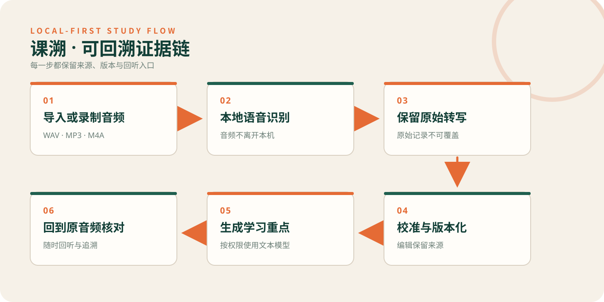
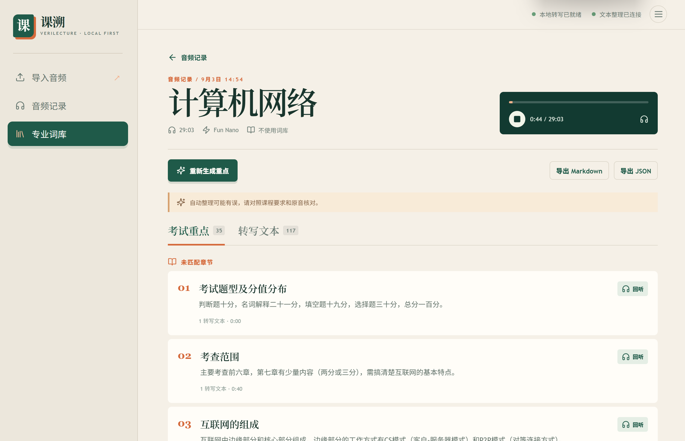
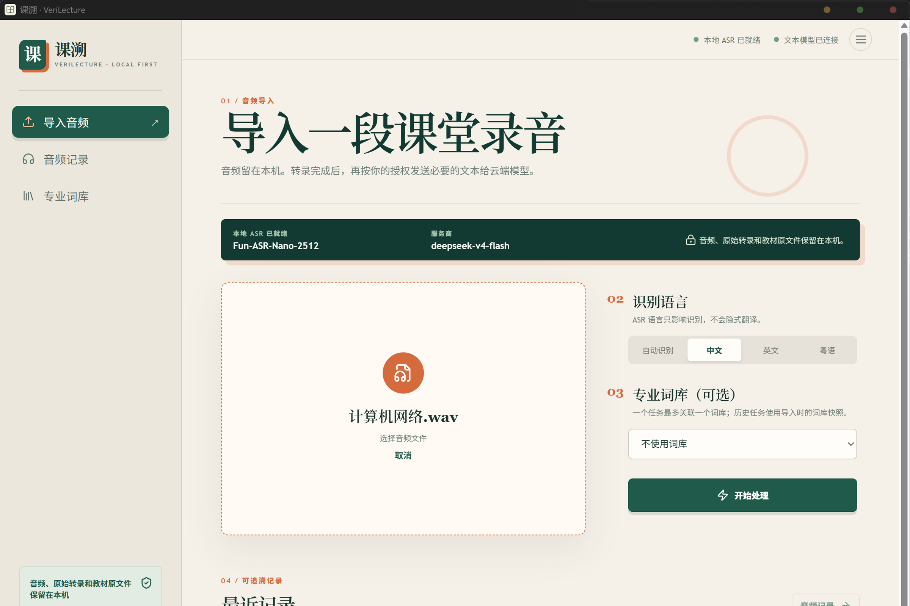
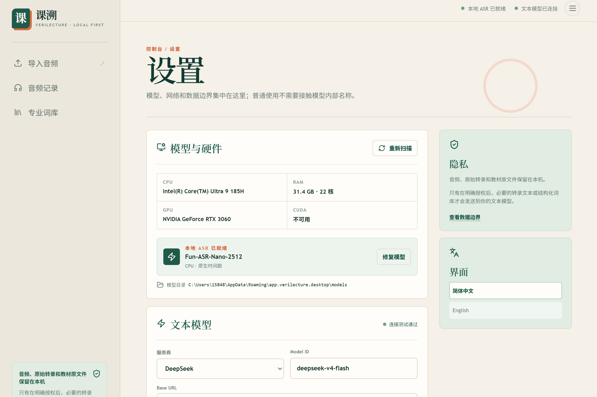
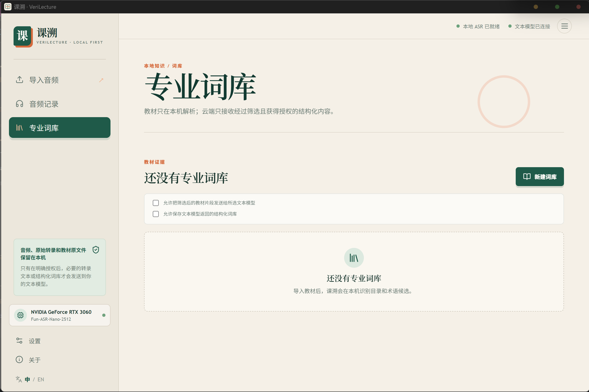

<h1 align="center">课溯 · VeriLecture</h1>

<div align="center">

**把课堂录音变成可核对的复习重点。**

*Trace every key point back to the lecture.*

[](https://github.com/xiajiadi/verilecture-v3/releases/tag/v0.3.0-alpha.4)
[](#平台状态)
[](#隐私与数据边界)
[](./LICENSE)

<p>
  <strong>简体中文</strong>
  &nbsp;·&nbsp;
  <a href="./README.en.md">English</a>
</p>

<p>
  <a href="https://xiajiadi.github.io/verilecture-v3/">产品主页</a>
  &nbsp;·&nbsp;
  <a href="https://github.com/xiajiadi/verilecture-v3/releases">下载与发行版本</a>
  &nbsp;·&nbsp;
  <a href="./docs/KNOWN_LIMITATIONS.md">已知限制</a>
</p>

</div>

> A local-first desktop app that turns lecture recordings into traceable review points linked back to source audio.

课溯从课堂录音开始，保留原始材料，整理转写和复习重点；需要确认时，回到对应时间点听原音。

<p align="center">
  <a href="./docs/diagrams/evidence-chain-zh.svg">
    
  </a>
</p>


课溯保留复习结果的来源，方便回到原音核对：

```text
课堂录音
   ↓
原始转写（保留，不覆盖）
   ↓
校准转写（派生版本，可选）
   ↓
复习重点（带时间点与来源片段）
   ↓
回到原音核对
```

一次整理可得到：

- **原始转写**：由本地 ASR 路线产生，供后续校准和编辑使用。
- **复习重点**：获得授权后由文本整理服务生成，保留对应的转写片段和时间点。
- **回听入口**：从重点或转写句子回到对应时间点，核对整理结果是否符合课堂原意。
- **可导出结果**：可导出 Markdown、JSON 和纯文本；源记录与派生版本分开保存。

## 为什么是课溯

### Traceability · 可追溯

每条重点都标明来自哪一段转写、对应哪一个时间点。如果整理结果需要确认，回到原音，而不是只相信一个结论。

### Local-first · 本地优先

音频、原始转写、教材文件和词库默认留在本机。本地转写不上传音频；文本模型是可选步骤，只有在你配置服务商并明确授权后才会发送必要内容。

### Source-preserving · 保留源记录

校准、修订和编辑会创建新的版本，不覆盖原始音频和原始转写。失败的分析也不会替换源材料。

### Hardware-aware · 按设备选择路线

首次使用会检查 CPU、内存、GPU、CUDA、磁盘空间和模型目录权限，再决定哪些本地转写路线可以安装或运行。硬件不满足时，界面会显示原因，而不是把不可用的模型当成已就绪。

## 界面与结果路径


<table>
<tr>
<td width="50%" valign="top">
<a href="./docs/screenshots/result-points-trace.png"></a>
<br /><sub><b>01 · 重点与回听</b><br />复习重点保留来源时间点，并可回到原音核对。</sub>
</td>
<td width="50%" valign="top">
<a href="./docs/screenshots/audio-import-selected.png"></a>
<br /><sub><b>02 · 导入课堂录音</b><br />显示本地 ASR、文本服务与数据边界，再开始处理。</sub>
</td>
</tr>
<tr>
<td valign="top">
<a href="./docs/screenshots/settings-models-and-text.png"></a>
<br /><sub><b>03 · 查看设备与运行状态</b><br />集中查看硬件、本地转写档位和文本服务状态。</sub>
</td>
<td valign="top">
<a href="./docs/screenshots/lexicon-empty-state.png"></a>
<br /><sub><b>04 · 整理课程词库</b><br />教材和专业词汇先在本机整理，再按权限参与校准。</sub>
</td>
</tr>
</table>

补充结果页实机证据：<br />
- [转写文本与原始转写](./docs/screenshots/result-transcript-source.png)：同一条记录的转写视图与原音控制。<br />
- [重点与回听时间点](./docs/screenshots/result-points-trace.png)：重点列表、来源时间点和回听入口。<br />


## 平台状态

`v0.3.0-alpha.4` 已发布 Windows、Linux 和 macOS 桌面安装包。桌面包的发布不等于每个平台都已经完成本地转写运行时验收。

| 平台 | 安装包 | 当前状态 |
| --- | --- | --- |
| Windows x64 | NSIS | 桌面应用、本地 Fun-ASR 路线和代表性 CUDA 路径已完成相应验证 |
| Linux x64 | AppImage | 桌面包已发布；原生本地 ASR sidecar 仍待发布与验证 |
| macOS | DMG | 桌面包已发布；原生本地 ASR sidecar 仍待发布与验证 |

Qwen3-ASR 档位还需要单独托管的 CUDA Runtime。约 4.6 GB（约 4.3 GiB）的 Runtime 不放进 Git，也不包含在当前 Release；在稳定 HTTPS 地址和完整验收完成前，安装器会保持下载门禁。详见 [CUDA Runtime 发布说明](./docs/CUDA_RUNTIME.md)。

## 下载与首次运行

当前公开版本：[**v0.3.0-alpha.4**](https://github.com/xiajiadi/verilecture-v3/releases/tag/v0.3.0-alpha.4)

- [Windows x64 NSIS 安装包](https://github.com/xiajiadi/verilecture-v3/releases/download/v0.3.0-alpha.4/VeriLecture_0.3.0-alpha.4_x64-setup.exe)
- [Linux x64 AppImage](https://github.com/xiajiadi/verilecture-v3/releases/download/v0.3.0-alpha.4/VeriLecture_0.3.0-alpha.4_amd64.AppImage)
- [macOS DMG](https://github.com/xiajiadi/verilecture-v3/releases/download/v0.3.0-alpha.4/VeriLecture_0.3.0-alpha.4_aarch64.dmg)
- [Release 页面与 SHA256 校验文件](https://github.com/xiajiadi/verilecture-v3/releases/tag/v0.3.0-alpha.4)

安装前请核对与安装包同名的 SHA256 文件。Alpha 版本用于体验和反馈，请先备份重要录音。

首次启动可以按以下顺序：

1. 阅读隐私边界，确认每类数据的授权范围。
2. 让课溯扫描硬件、CUDA、存储和模型目录。
3. 安装当前设备可以运行的本地转写档位。
4. 先用短音频测试，再导入完整课堂录音。

没有可用 NVIDIA GPU 时，优先选择 **Fun-ASR-Nano-2512**。Qwen 档位请等待 Release 明确说明 CUDA Runtime 已公开托管并通过验收。

## 隐私与数据边界

- 音频、原始转写、教材文件、词库和生成结果默认保留在本机。
- 本地转写不上传音频。
- 文本模型请求需要用户配置的服务商和明确授权。
- 转写文本、结构化词库数据和限定的教材片段分别受权限控制。
- 原始材料不可变；修订、校准和编辑会创建带来源的新版本。
- 项目不以学生姓名、学号、身份证号、电话号码或个人成绩等身份信息作为工作数据。

详细边界见 [隐私与安全](./docs/PRIVACY_AND_SECURITY.md)、[模型来源](./docs/MODEL_REGISTRY.md) 和 [第三方声明](./THIRD_PARTY_NOTICES.md)。

## 已知 Alpha 限制

这些限制属于当前版本的一部分，不应被下载按钮或平台徽章隐藏：

- `v0.3.0-alpha.4` 仍是 Alpha 版本，不是稳定版。
- Linux 和 macOS 目前提供桌面应用包；本地 ASR sidecar 仍需单独发布和验证。
- Qwen3-ASR-0.6B 与 Qwen3-ASR-1.7B 需要兼容的 NVIDIA CUDA 路径和公开托管的 CUDA Runtime。
- 模型权重首次使用时下载，需要网络、磁盘空间和完整性检查。
- 长音频按有界本地任务处理，当前界面没有提供持久化的任务内断点续跑。
- 文本模型能力是可选的，需要用户配置服务商并逐类授权；目前尚未覆盖所有服务商和长文档场景。
- Windows 安装包默认未签名，除非发布环境提供签名配置。

完整列表见 [已知限制](./docs/KNOWN_LIMITATIONS.md)。

## 文档与开源协作

- [贡献指南](./CONTRIBUTING.md)：本地开发、测试、截图和 Release 工作流。
- [安全与隐私报告](./SECURITY.md)：不要在公开 Issue 中提交录音、转写、密钥或敏感漏洞细节。
- [版本记录](./CHANGELOG.md)：按用户可感知变化整理的版本历史。
- [Release 叙事模板](./docs/releases/RELEASE_TEMPLATE.md)：为后续版本保留平台状态、校验和限制说明。
- [平台构建说明](./docs/PLATFORM_BUILD.md)：桌面打包与平台依赖。
- [模型注册表](./docs/MODEL_REGISTRY.md)：模型来源、版本和校验信息。

## 从源码构建

受支持的应用源码位于 `frontend/`。完整命令、平台依赖和发布前检查见 [CONTRIBUTING.md](./CONTRIBUTING.md)。最小本地检查如下：

```powershell
Set-Location .\frontend
pnpm install --frozen-lockfile
pnpm typecheck
pnpm test
pnpm build
```

修改 README、官网或其他用户可见文字前，请先阅读 [writing/STYLE_GUIDE.md](./writing/STYLE_GUIDE.md)。

## 项目事实

- 产品名：**课溯 · VeriLecture**
- 当前公开版本：`v0.3.0-alpha.4`
- 应用 ID：`app.verilecture.desktop`
- 主要源码：`frontend/`
- 官网源码：`site/`
- 许可证：[MIT License](./LICENSE)
- 上游归属与第三方许可：[NOTICE](./NOTICE)、[THIRD_PARTY_NOTICES.md](./THIRD_PARTY_NOTICES.md)

<div align="center">

**让重点可复习，也让核对有出处。**

*Trace every key point back to the lecture.*

</div>
